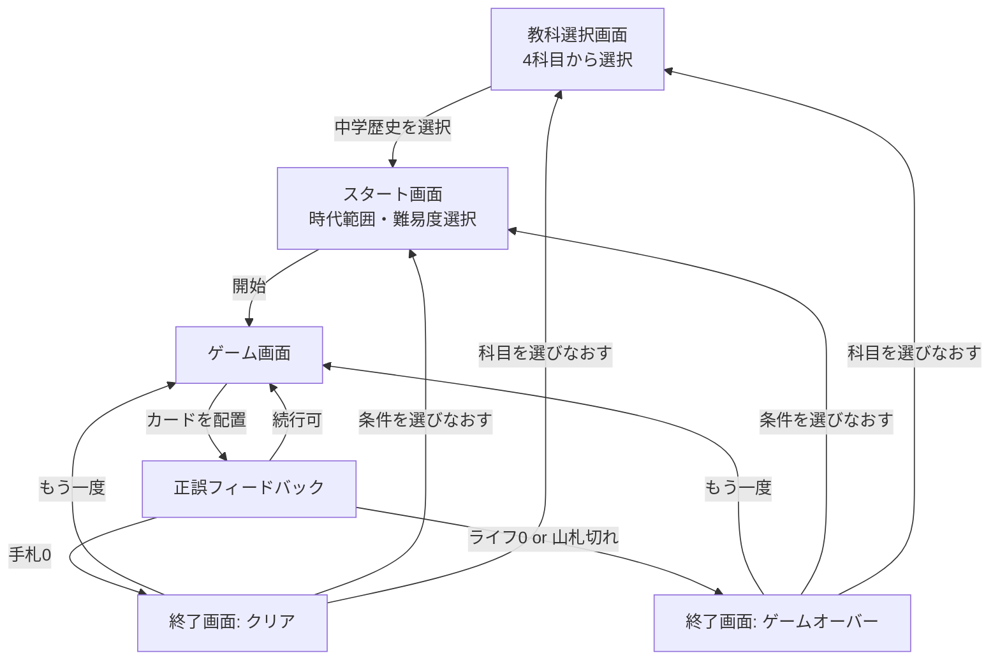

# ChronoLine(歴史タイムラインゲーム) 要件定義書(実装用) — v1スコープ: 中学歴史

## 1. 概要

出来事カードを「これより前」「これより後」と考えながら年代順に並べていく1人用(将来的に対戦も検討)のカードゲーム。正解の判断材料は正確な年号の暗記ではなく、歴史の因果関係・技術の前後関係からの推測。

科目(デッキ)は **中学受験歴史・中学歴史・高校日本史・高校世界史** の4種類に分ける。**v1では中学歴史の完成のみを目標とし**、他の3科目は選択肢として画面に用意するが、データが揃うまで「準備中」として選択不可にする(4章参照)。

紙のプロトタイプ(24枚、中学歴史相当)でのテストプレイは既に方針を確認済み。本書はそれをアプリ化するための仕様書。

## 2. 対象ユーザー・利用シーン

- 中学生(個人利用、スマホでの1人プレイが中心)
- 知識量に幅がある前提。「知っていれば有利、知らなくても推測で楽しめる」バランスを保つ

## 3. ゲームの基本ルール

- 場(フィールド)には最初に1枚だけカードが置かれている(タイトルのみ表示、年代は非公開)
- 手札から1枚選び、場のカード列のどこか(隙間)に「ここが正しい位置」として差し込む
- 差し込んだ瞬間に正誤判定される
  - **正解**: そのカードは場に残る(以後もタイトルのみ表示。年代・解説は差し込み直後に一瞬だけ表示し、その後は非公開に戻る。場のカードをタップすると再度年代・解説を確認できる)。手札が1枚減る
  - **不正解**: そのカードは捨てられ、山札から1枚引いて手札を補充する(手札枚数は変わらない)。ライフが1減る
- **クリア条件**: 手札が0枚になる
- **ゲームオーバー条件**: ライフが0になる、または山札が尽きて手札を補充できなくなる

場に並ぶカードが増えるほど隙間が狭くなり、自然と難易度が上がる構造はそのまま維持する。

## 4. 機能要件

### 4.1 教科選択画面

アプリ起動後、最初に表示する画面。4つの科目(デッキ)から1つを選ぶ。

| 科目 | subjectId | v1での状態 |
|---|---|---|
| 中学受験歴史 | `juken-rekishi` | 準備中(選択不可) |
| 中学歴史 | `chugaku-rekishi` | **利用可能(v1のメイン対象)** |
| 高校日本史 | `koko-nihonshi` | 準備中(選択不可) |
| 高校世界史 | `koko-sekaishi` | 準備中(選択不可) |

- データが揃っていない科目はカードをグレーアウトし、「準備中」バッジを表示する。タップしても遷移しない
- `chugaku-rekishi` を選ぶと4.2のスタート画面(時代範囲・難易度選択)に進む
- 科目ごとに `Deck` ファイルが分かれているだけで、時代範囲選択・難易度選択・判定ロジックのコードは共通(6章のデータモデル参照)。新しい科目を追加する際はJSONファイルを1つ増やし、上表の状態を「利用可能」に切り替えるだけで済む構造にする

### 4.2 スタート画面

以下をユーザーが設定してからゲームを開始する。

**① 時代範囲の指定(幅指定)**

「開始時代」「終了時代」をそれぞれ選ぶ(プルダウンまたはスライダー)。デッキが持つ時代の並び順(下記データモデル参照)に従い、その範囲に含まれる時代の用語だけが出題対象になる。

- 例: 開始=鎌倉、終了=江戸 → 鎌倉〜江戸時代の用語のみが出題プールに入る
- 開始 > 終了は選択不可(UIで制御)

**② 難易度の指定(重要度ベース)**

各用語は「重要度」を持つ(下記データモデル参照)。難易度は重要度の上限でプールを絞り込む。

| 難易度 | 含める重要度 | 想定 |
|---|---|---|
| かんたん | 1のみ | 教科書の太字・超頻出用語だけ |
| ふつう | 1〜2 | 標準的な範囲 |
| むずかしい | 1〜3 | 発展的な用語も含む(※現在のカードセットには重要度3が未収録。今後の追加を見込んだ設計) |

**③ プールの検証**

「時代範囲」×「難易度」で絞り込んだ結果が **4枚未満** の場合は「開始」ボタンを無効化し、「選べる用語が少なすぎます(現在○枚)。範囲を広げるか難易度を上げてください」と表示する。

**④ 開始処理**

- プールから初期の場札を1枚ランダムに選出
- 残りのプールから手札を `min(6, プール残り枚数)` 枚配る
- 残りは山札とする

### 4.3 ゲーム画面

- 場: 左(古い)〜右(新しい)にカードをタイトルのみで横並び表示。隙間をタップ/ドラッグで選べる
- 手札: 画面下部にカード一覧。1枚選択→場の隙間を選択、の2ステップ操作(ドラッグ&ドロップでも可)
- 差し込み直後: 正誤とあわせて年代・一言解説をカード上、または簡易モーダルで一時表示
- ライフ表示、残り手札枚数表示を常時表示

### 4.4 終了画面

- クリア/ゲームオーバーを明示
- 結果(誤答数、かかったターン数など)を表示
- ベストスコア(端末のローカルストレージに保存、個人情報は扱わない)を表示・更新
- 「もう一度あそぶ(同条件)」「時代・難易度を選びなおす」の導線

## 5. 判定ロジック(厳密な定義)

- 場のカードは `yearValue`(数値、紀元前は負数)で昇順に並んでいる
- 新カードを位置 `i`(左から `i` 番目の隙間、`0 <= i <= 場の枚数`)に差し込む場合:
  - 左隣が存在する場合: `新カード.yearValue >= 左隣.yearValue` であること
  - 右隣が存在する場合: `新カード.yearValue <= 右隣.yearValue` であること
  - 両方満たせば正解、どちらか一方でも満たさなければ不正解
- **同年の扱い(境界値)**: 等号(`>=` `<=`)を用いることで、同年のカードが隣接する場合はどちら側に差し込んでも正解として扱う。現行24枚に同年カードは存在しないが、ユニットテストでは境界値ケース(同年、隣接、両端への挿入)を必ず含めること
- **紀元前の扱い**: 「稲作が伝わる」のような幅のある年代は、表示用の `yearLabel`(例: "紀元前4〜5世紀ごろ")と、判定用の数値 `yearValue`(例: `-450`)を分離して持つ。判定は常に `yearValue` を使う

## 6. データモデル

```typescript
type Importance = 1 | 2 | 3; // 1=必修 2=標準 3=発展

interface Card {
  id: string;
  era: string;        // このデッキのeraList内のいずれか
  yearValue: number;   // 判定用。紀元前は負数
  yearLabel: string;   // 表示用の年代文字列
  title: string;       // 出来事名(場に表示されるのはこれだけ)
  description: string; // 一言解説(正誤判定後に表示)
  importance: Importance;
}

interface Deck {
  subjectId: string;    // 例: "chugaku-rekishi"
  subjectLabel: string; // 例: "中学歴史"
  eraList: string[];    // 時代範囲選択に使う順序付きリスト
  cards: Card[];
}

type SubjectStatus = "available" | "coming_soon";

interface SubjectMeta {
  subjectId: string;
  subjectLabel: string;
  status: SubjectStatus;
  deckFile: string; // 対応するDeckのJSONファイルパス(availableのときのみ実在)
}

const SUBJECTS: SubjectMeta[] = [
  { subjectId: "juken-rekishi",   subjectLabel: "中学受験歴史", status: "coming_soon", deckFile: "decks/juken-rekishi.json" },
  { subjectId: "chugaku-rekishi", subjectLabel: "中学歴史",     status: "available",   deckFile: "decks/chugaku-rekishi.json" },
  { subjectId: "koko-nihonshi",   subjectLabel: "高校日本史",   status: "coming_soon", deckFile: "decks/koko-nihonshi.json" },
  { subjectId: "koko-sekaishi",   subjectLabel: "高校世界史",   status: "coming_soon", deckFile: "decks/koko-sekaishi.json" },
];
```

新しい科目を追加する際は、対応する `Deck` のJSONファイルを作成し、`SUBJECTS` 配列の該当行の `status` を `available` に変えるだけでよい。時代範囲選択UI・難易度フィルタ・判定ロジックのコードは科目に依存しないため変更不要(詳細は9章)。

## 7. カードデータ(中学歴史・24枚)

時代の並び順(`eraList`):
```
["弥生", "古墳", "飛鳥", "奈良", "平安", "鎌倉", "室町・戦国", "安土桃山", "江戸", "明治", "大正", "昭和(戦前)"]
```
※「古墳」は現行カードセットに該当カードなし。将来の追加を見込んで並び順にのみ含めている。

```json
[
  { "id": "jp001", "era": "弥生", "yearValue": -450, "yearLabel": "紀元前4〜5世紀ごろ", "title": "稲作が伝わる", "description": "大陸から稲作技術が伝わり、弥生時代が始まる", "importance": 1 },
  { "id": "jp002", "era": "弥生", "yearValue": 239, "yearLabel": "239年", "title": "卑弥呼が魏に使いを送る", "description": "邪馬台国の女王卑弥呼が中国に使者を派遣", "importance": 1 },
  { "id": "jp003", "era": "飛鳥", "yearValue": 604, "yearLabel": "604年", "title": "聖徳太子が十七条の憲法を制定", "description": "役人の心構えを示した憲法", "importance": 1 },
  { "id": "jp004", "era": "飛鳥", "yearValue": 645, "yearLabel": "645年", "title": "大化の改新", "description": "中大兄皇子らが蘇我氏を倒し政治改革", "importance": 1 },
  { "id": "jp005", "era": "奈良", "yearValue": 710, "yearLabel": "710年", "title": "平城京に都を移す", "description": "奈良に都、律令国家の完成期", "importance": 1 },
  { "id": "jp006", "era": "平安", "yearValue": 794, "yearLabel": "794年", "title": "平安京に都を移す", "description": "桓武天皇が京都に遷都", "importance": 1 },
  { "id": "jp007", "era": "平安", "yearValue": 894, "yearLabel": "894年", "title": "遣唐使が廃止される", "description": "菅原道真の提言で停止、国風文化へ", "importance": 2 },
  { "id": "jp008", "era": "鎌倉", "yearValue": 1192, "yearLabel": "1192年", "title": "源頼朝が征夷大将軍になる", "description": "鎌倉幕府の実質的な始まり", "importance": 1 },
  { "id": "jp009", "era": "鎌倉", "yearValue": 1274, "yearLabel": "1274年", "title": "元寇(文永の役)", "description": "モンゴル軍が九州に襲来", "importance": 2 },
  { "id": "jp010", "era": "鎌倉", "yearValue": 1333, "yearLabel": "1333年", "title": "鎌倉幕府が滅びる", "description": "後醍醐天皇らにより滅亡", "importance": 2 },
  { "id": "jp011", "era": "室町・戦国", "yearValue": 1338, "yearLabel": "1338年", "title": "室町幕府が開かれる", "description": "足利尊氏が征夷大将軍に", "importance": 2 },
  { "id": "jp012", "era": "室町・戦国", "yearValue": 1467, "yearLabel": "1467年", "title": "応仁の乱が起こる", "description": "11年続いた戦乱、戦国時代の幕開け", "importance": 1 },
  { "id": "jp013", "era": "室町・戦国", "yearValue": 1543, "yearLabel": "1543年", "title": "種子島に鉄砲が伝わる", "description": "ポルトガル人が漂着し伝来", "importance": 1 },
  { "id": "jp014", "era": "安土桃山", "yearValue": 1582, "yearLabel": "1582年", "title": "本能寺の変", "description": "織田信長が明智光秀に討たれる", "importance": 1 },
  { "id": "jp015", "era": "安土桃山", "yearValue": 1600, "yearLabel": "1600年", "title": "関ヶ原の戦い", "description": "徳川家康が勝利し天下の実権を握る", "importance": 1 },
  { "id": "jp016", "era": "江戸", "yearValue": 1603, "yearLabel": "1603年", "title": "江戸幕府が開かれる", "description": "家康が征夷大将軍に就任", "importance": 1 },
  { "id": "jp017", "era": "江戸", "yearValue": 1639, "yearLabel": "1639年", "title": "鎖国が完成する", "description": "ポルトガル船来航禁止で体制が固まる", "importance": 2 },
  { "id": "jp018", "era": "江戸", "yearValue": 1716, "yearLabel": "1716年", "title": "享保の改革が始まる", "description": "徳川吉宗による財政再建策", "importance": 2 },
  { "id": "jp019", "era": "江戸", "yearValue": 1853, "yearLabel": "1853年", "title": "黒船が浦賀に来航", "description": "ペリー来航、開国のきっかけ", "importance": 1 },
  { "id": "jp020", "era": "江戸", "yearValue": 1867, "yearLabel": "1867年", "title": "大政奉還", "description": "徳川慶喜が政権を朝廷に返上", "importance": 1 },
  { "id": "jp021", "era": "明治", "yearValue": 1894, "yearLabel": "1894年", "title": "日清戦争が始まる", "description": "朝鮮をめぐり清と開戦", "importance": 1 },
  { "id": "jp022", "era": "明治", "yearValue": 1904, "yearLabel": "1904年", "title": "日露戦争が始まる", "description": "ロシアとの戦争、日本が辛勝", "importance": 1 },
  { "id": "jp023", "era": "大正", "yearValue": 1923, "yearLabel": "1923年", "title": "関東大震災", "description": "東京・横浜を中心に大きな被害", "importance": 2 },
  { "id": "jp024", "era": "昭和(戦前)", "yearValue": 1945, "yearLabel": "1945年", "title": "太平洋戦争が終わる", "description": "ポツダム宣言受諾、敗戦", "importance": 1 }
]
```

内訳: 重要度1が16枚、重要度2が8枚、重要度3は0枚(今後の拡張で追加)。

## 8. 画面遷移


(他3科目は準備中のため選択不可・タップ無反応)

## 9. 他3科目を追加する際の設計方針

v1では `chugaku-rekishi` のみデータを完成させる。他3科目は6章の `SUBJECTS` に `coming_soon` として登録済みなので、UI・ロジックへの影響なしに後から差し込める。各科目のカード設計時に想定しておくべき違いは以下の通り。

- **中学受験歴史(`juken-rekishi`)**: 中学歴史よりカード枚数を増やし、時代内の間隔が近い(=紛らわしい)組み合わせを厚めにする。受験に必須の頻出年号を重要度1、差がつく細かい年号を重要度2〜3に振る運用を想定
- **高校日本史(`koko-nihonshi`)**: 中学歴史の `eraList` をベースにしつつ、時代区分をより細かく分割する(例:「江戸」を「江戸前期/中期/後期」に分ける等)。重要度3(発展)を本格的に使う最初の科目になる想定
- **高校世界史(`koko-sekaishi`)**: `eraList` を日本史とは別に地域・時代軸で新規設計する(古代オリエント〜現代など)。日本史カードとは完全に独立した `Deck` になる。将来的には地域タグ(`region`)を `Card` に追加し、同時代の複数地域をレーン表示する拡張も検討余地として残す(v1のスコープ外)

いずれの科目も、6章の `Card` / `Deck` / `SubjectMeta` の型を変えずに追加できることを設計上の前提とする。

## 10. 非機能要件

- モバイルファースト(幅375〜430px想定)、レスポンシブでタブレット・PCでも崩れない
- データ保存はローカルストレージのみ。個人を識別する情報は扱わない
- キーボード操作でも一連の操作(範囲選択・難易度選択・カード配置)ができること
- `prefers-reduced-motion` に配慮する
- 演出は正誤時のアニメーションのみ。効果音はデフォルトOFF(設定でON可能にするのは任意)

## 11. 技術方針

- 現行プロトタイプは単一HTML(バニラJS)。本実装ではロジック・データ・表示を分離した構成に作り直すことを推奨
- 想定スタック例: Vite + TypeScript + 軽量フレームワーク(任意)。ビルド不要なバニラ構成でも可
- カードデータ・デッキ構成は7章のJSONをそのまま `src/data/decks/chugaku-rekishi.json` に配置する。他3科目のファイル(`juken-rekishi.json` 等)はv1では未作成でよいが、6章の `SUBJECTS` 配列にはエントリだけ用意しておく
- 判定ロジック(5章)は年代比較の境界値(同年、両端挿入)を含めてユニットテストを書く
- 時代範囲×難易度のプール絞り込みロジックも、境界(プール4枚未満で開始不可)を含めてテストする
- スコアの読み書きは `saveScore()` / `loadScore()` のような専用関数に集約する。将来サーバー保存に切り替える際、この関数の中身を差し替えるだけで済み、ゲーム画面側のコードには手を入れずに済む

### 11.1 ホスティング(GitHub Pages、確定)

- 静的サイトとしてビルドし、GitHub Pagesで配信する(バックエンドサーバーなし、10章の非機能要件どおり)
- デプロイはGitHub Actions(`actions/deploy-pages`)で `main` ブランチへのpush時に自動ビルド・公開する構成を推奨
- Viteを使う場合、`vite.config.ts` の `base` をリポジトリ名のパスに設定する(例: `base: "/repo-name/"`)。独自ドメインを使う場合はこの設定は不要
- 画面遷移(教科選択→スタート→ゲーム→結果)は、URLルーティングを使わず1ページ内の状態管理(コンポーネントの出し分け)で実装する。GitHub PagesはサーバーでのURLリライトができないため、SPAルーターを使うとリロード時に404になる問題があり、それを避けるための選択

## 12. 受け入れ基準(Doneの定義)

- 教科選択画面に4科目が表示され、「中学歴史」のみ選択可能、他3科目は準備中として選択できないことが分かる表示になっている
- 任意の時代範囲(開始・終了)を選ぶと、該当範囲の用語のみが出題プールに含まれる
- 難易度(かんたん/ふつう/むずかしい)を選ぶと、重要度に応じてプールが正しく絞り込まれる
- 範囲×難易度でプールが4枚未満のとき、開始ボタンが無効化され理由が表示される
- 場への差し込み判定が、境界値(同年、両端への挿入)を含めて数学的に矛盾なく動作する
- 正解時は手札が1枚減り、場のカードが増える。不正解時はライフが1減り、手札が入れ替わる(枚数は維持)
- 手札0でクリア画面、ライフ0または山札切れでゲームオーバー画面に正しく遷移する
- ベストスコアが端末に保存され、次回起動時にも表示される
- 幅375px程度のモバイル画面でレイアウトが崩れず、主要操作がキーボードのみでも行える

## 13. 残っている未決定事項

- 場の初期カードの選び方(単純ランダムか、極端に古い/新しいカードを避けるロジックを入れるか)→ v1は単純ランダムを推奨
- ライフの初期値(本書では3を推奨値として想定。明記した仕様ではないため実装時に確定すること)
- 正解後、場のカードを再度タップして年代を確認できる機能の要否(本書では「あり」を推奨として6章に明記済み。不要ならUIを削れる)
- 他3科目(中学受験歴史・高校日本史・高校世界史)のカードデータ・時代区分は本書のスコープ外。中学歴史が完成した後、科目ごとに別途カードリストを作成するフェーズとする
